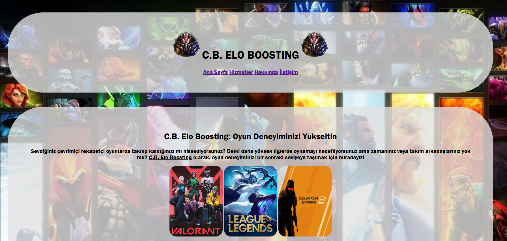

# ODEV-3 

## Web Sitesine Aşağıdaki Linkten Erişebilirsiniz

📌 https://canbozv5.github.io/Rehber-Web-Sitem 📌

## Web Sitesinin Ufak Bir Önizlemesi 

## Aşağıdaki Koşullar ile Yaptığım Rehber Web Sitem

### Genel Yapı:

- Ana sayfa (index.html) ve en az üç alt sayfa (örneğin, hakkinda.html, iletisim.html, servisler.html) oluşturun.

- Her sayfanın temel yapısını oluşturmak için HTML5 doküman yapısını kullanın.

- head etiketinin içinde sayfanın başlığı (title) ve karakter seti (meta charset="UTF-8") olmalıdır.

### Navigasyon Menüsü:

- Her sayfanın en üstünde, diğer sayfalara bağlantılar içeren bir navigasyon menüsü oluşturun. Menüde en az dört bağlantı (a) olmalıdır: Ana Sayfa, Hakkında, Servisler, İletişim.

### Ana Sayfa (index.html):

- Ana sayfada web sitenizin amacını belirten bir ana başlık (h1) olmalıdır.

- Bir tanıtım metni için birkaç paragraf (p) yazın.

- En az bir görsel (img) ekleyin ve alt özniteliğini doldurun.

- Ana sayfada ayrıca en az bir sıralı liste (ol) veya sırasız liste (ul) kullanarak önemli noktaları veya hizmetleri listeleyin.

### Hakkında Sayfası (hakkinda.html):

- Şirketiniz veya kendiniz hakkında bilgi veren bir başlık (h2) ve birkaç paragraf (p) yazın.

- Kuruluş tarihleri veya önemli olaylar için sıralı liste (ol) kullanın.

### Servisler Sayfası (servisler.html):

- Sunulan hizmetlerin bir listesini oluşturun. Her hizmet için bir başlık (h2) ve açıklayıcı bir paragraf (p) ekleyin.

- Hizmetleri tanımlamak için sırasız liste (ul) kullanın.

### İletişim Sayfası (iletisim.html):

- İletişim bilgilerini içeren bir başlık (h2) ve bir paragraf (p) yazın.

- İletişim bilgileri (adres, telefon, e-posta) için bir sırasız liste (ul) kullanın.

- Bir iletişim formu (form) oluşturun. Formda ad, e-posta ve mesaj alanları olmalıdır. (Kullanıcıdan giriş almak için sadece HTML kullanın, formu işlemek için herhangi bir arka uç dili gerekmiyor.)
